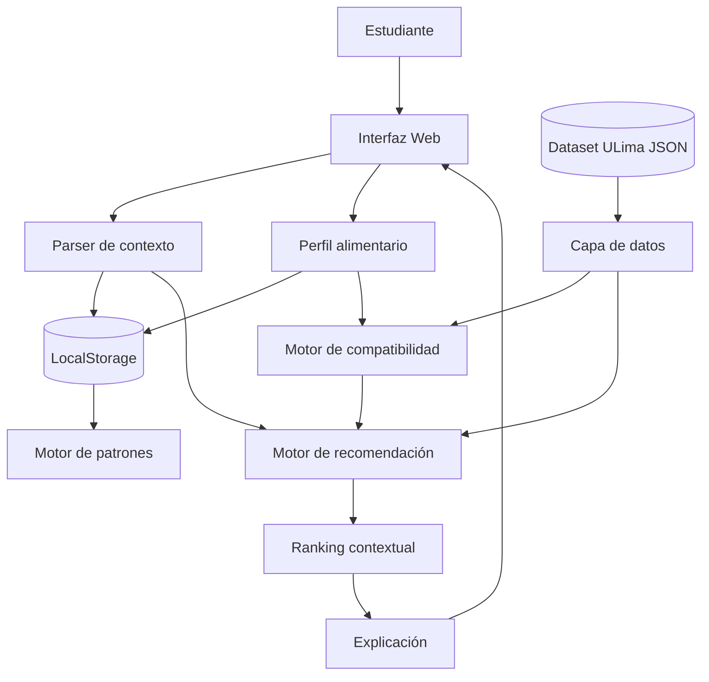
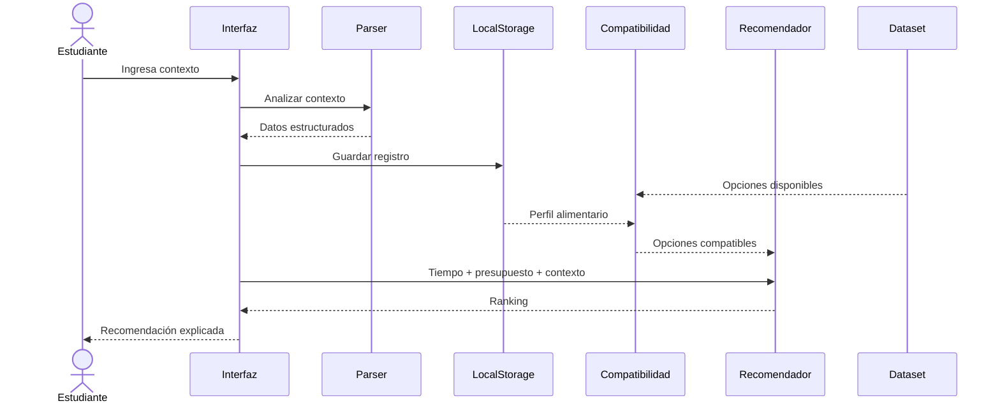
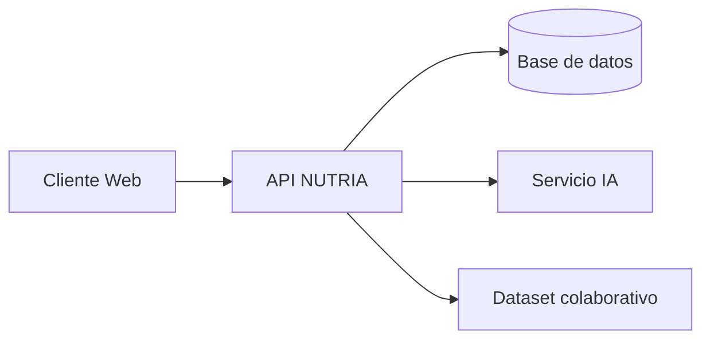

# Arquitectura de NUTRIA

## 1. Visión general

NUTRIA utiliza una arquitectura **local-first, modular y orientada al navegador**.

El MVP evita depender de infraestructura externa para completar su flujo principal. El contexto y perfil del estudiante se procesan localmente y se combinan con un dataset estructurado de opciones de comida.

---

## 2. Arquitectura general



---

## 3. Flujo principal

```text
Estudiante
    ↓
Ingresa contexto
    ↓
Parser
    ↓
Contexto estructurado
    ↓
Perfil alimentario
    +
Dataset ULima
    ↓
Compatibilidad
    ↓
Opciones elegibles
    ↓
Presupuesto + tiempo
    ↓
Ranking contextual
    ↓
Recomendación explicable
```

---

## 4. Parser de contexto

Ubicación:

```text
js/parser/
```

El parser transforma texto natural como:

> “Dormí 4 horas, no almorcé, tengo parcial en 40 minutos y me quedan S/12.”

en datos estructurados:

```text
sueño = 4 horas
comidaOmitida = almuerzo
evento = parcial
tiempoDisponible = 40 minutos
presupuesto = 12
```

El MVP utiliza reglas determinísticas, expresiones regulares y palabras clave.

---

## 5. Perfil alimentario

Contiene información declarada voluntariamente por el estudiante como:

```text
Preferencias
Restricciones alimentarias
Campus
```

Ejemplo:

```text
Campus: Universidad de Lima
Preferencia: vegetariano
Restricción declarada: lactosa
```

Esta información se utiliza antes del ranking.

---

## 6. Capa de datos

Ubicación:

```text
js/datos/
data/
```

Contiene:

- historial local;
- dataset de alimentos;
- opciones alrededor del campus;
- precios;
- tiempos;
- información de compatibilidad;
- datos utilizados para demostración.

---

## 7. Motor de compatibilidad

Ubicación:

```text
js/motor/compatibilidad.js
```

Evalúa:

```text
Perfil alimentario
        +
Opción de comida
```

y clasifica una alternativa como:

```text
eligible
warning
excluded
```

Las alternativas excluidas no pasan al ranking principal.

---

## 8. Motor de recomendación

Ubicación:

```text
js/motor/recomendador.js
```

Combina variables como:

```text
Compatibilidad
+
Presupuesto
+
Tiempo disponible
+
Campus
+
Contexto académico
```

para generar un ranking.

Ejemplo:

```text
Presupuesto: S/12
Tiempo: 40 min
Preferencia: vegetariano

↓

1. Opción A
2. Opción B
3. Opción C
```

---

## 9. Explicabilidad

NUTRIA muestra al estudiante por qué una opción aparece en el ranking.

Ejemplo:

```text
Recomendado porque:

✓ cuesta S/10
✓ está dentro de tu presupuesto
✓ se encuentra cerca del campus
✓ es compatible con tu perfil
✓ tienes suficiente tiempo antes de tu parcial
```

---

## 10. Persistencia

El MVP utiliza:

```text
localStorage
```

para almacenar:

- registros;
- preferencias;
- perfil;
- patrones;
- configuración local.

Esto permite completar el flujo sin crear una cuenta.

---

## 11. Flujo de datos



---

## 12. Privacidad

El MVP sigue un enfoque **local-first**.

La información personal utilizada durante el flujo principal permanece en el dispositivo:

- historial;
- contexto ingresado;
- perfil alimentario;
- patrones.

No es necesario enviar esta información a un modelo externo para generar la recomendación.

---

## 13. IA

Para la primera versión se utiliza un enfoque determinístico.

```text
Entrada natural
      ↓
Parser
      ↓
Reglas
      ↓
Contexto estructurado
```

Esto permite que el sistema sea reproducible y explicable.

A futuro puede añadirse una segunda capa:

```text
Parser determinístico
        ↓
¿Entendió correctamente?
    ↙          ↘
   Sí          No
   ↓            ↓
motor        modelo IA
   \            /
    recomendador
```

La IA complementaría al sistema, pero no reemplazaría la lógica base.

---

## 14. Arquitectura futura



Una versión futura permitiría:

- soporte para múltiples universidades;
- sincronización entre dispositivos;
- actualización comunitaria de establecimientos;
- moderación;
- disponibilidad actualizada;
- cuentas de usuario;
- recomendaciones más avanzadas.

Estas funcionalidades quedan fuera del alcance del MVP de la hackathon.
